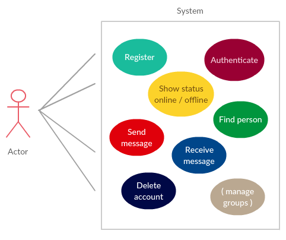

Application
===========

DESCRIPTION
-----------

App will allow user to communicate securely with other app users. Once
registered, user will be able to list other users, show their status
(online / offline), send and receive messages and also delete his or her
account.

Each user will be connected to the server in order to communicate with
other users. The server will perform following operations:

-   Search for specific person based on search query given
-   Allow user to establish secure channel to other users (by storing
    their public keys and other required information)
-   Store encrypted messages for offline recipients
-   To close secure channels
-   Periodically request new identification information for secure
    channel establishment (once a week or so)
-   User database management (registration + deletion)

IMPLEMENTATION: Linux

The client side will take care of:

-   Friendly GUI -- CEGUI
-   Sending and receiving messagess (encryption and decryption)
-   (groups management)

IMPLEMENTATION: Linux (Windows)

CROSS-PLATFORM ENCODING
-----------------------

To evade multi-platform syntax problems the application will use Base64 encoding.
----------------------------------------------------------------------------------

SECURITY
--------

The application will use following crypthographic functions:

-   RSA 2048bit (for secure channel establishment and derivation of
    cipher keys for messages sent)
-   AES-128 (for message encryption)
-   (eliptic curve cipher in future)[]{#anchor}

The RSA 2048-bit is the shortest version with currently satisfying security strength (at least for a few years) -- the interface described by API section will allow easy switch for 4086bit version if needed.

AES-128 has advantages of: currently satisfying security strength and ready-to-go implementation.

The hashing functions used:
-   SHA-512 (for its ready-to-go implementation)

For the implementation of descibed security means we use mbedTLS open source project from ARM Ltd. The library is lightweight and portable.
But the main advantage is its simple and fully documented API.

The secure channel is established with X3DH (key agreement) protocol where symetric key for AES-128 is decided. Once the key is agreed on, new keys are derived from the initial one each time the message is sent using Double Ratchet protocol.

GUI
---

Postponed.

API
---

Autogenerated by Doxygen.
`make api`

Conventions
-----------

The Google C++ Style Guide (https://google.github.io/styleguide/cppguide.html) can provide a good measure of our code syntactical quality. It is not important to follow it blindly but take inspiration from it as it is wanted to stick to unified code style in the whole project.
